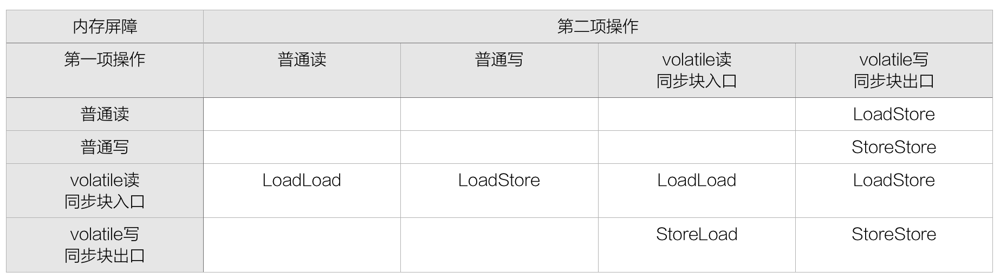

> Unsafe类在jdk源码的多个类中用到，这个类的提供了一些绕开JVM的更底层功能，基于它的实现可以提高效率。
> 但是，它是一把双刃剑：正如它的名字所预示的那样，它是Unsafe的，它所分配的内存需要手动free（不被GC回收）。
> Unsafe类，提供了JNI某些功能的简单替代：确保高效性的同时，使事情变得更简单。
> 更多信息请前往[API](http://www.docjar.com/docs/api/sun/misc/Unsafe.html)查看 
> 本文[参考地址](http://mishadoff.com/blog/java-magic-part-4-sun-dot-misc-dot-unsafe/)

## API
Unsafe API的大部分方法都是native实现，它由105个方法组成，主要包括以下几类  
### 属性

|属性名|属性值|
|:---:|:---:|
|INVALID_FIELD_OFFSET|-1|
|ARRAY_BOOLEAN_BASE_OFFSET|Unsafe.arrayBaseOffset(boolean[].class)|
|ARRAY_BYTE_BASE_OFFSET|Unsafe.arrayBaseOffset(byte[].class)|
|ARRAY_SHORT_BASE_OFFSET|Unsafe.arrayBaseOffset(short[].class)|
|ARRAY_CHAR_BASE_OFFSET|Unsafe.arrayBaseOffset(char[].class)|
|ARRAY_INT_BASE_OFFSET|Unsafe.arrayBaseOffset(int[].class)|
|ARRAY_LONG_BASE_OFFSET|Unsafe.arrayBaseOffset(long[].class)|
|ARRAY_FLOAT_BASE_OFFSET|Unsafe.arrayBaseOffset(float[].class)|
|ARRAY_DOUBLE_BASE_OFFSET|Unsafe.arrayBaseOffset(double[].class)|
|ARRAY_OBJECT_BASE_OFFSET|Unsafe.arrayBaseOffset(Object[].class)|
|ARRAY_BOOLEAN_INDEX_SCALE|Unsafe.arrayIndexScale(boolean[].class)|
|ARRAY_BYTE_INDEX_SCALE|Unsafe.arrayIndexScale(byte[].class)|
|ARRAY_SHORT_INDEX_SCALE|Unsafe.arrayIndexScale(short[].class)|
|ARRAY_CHAR_INDEX_SCALE|Unsafe.arrayIndexScale(char[].class)|
|ARRAY_INT_INDEX_SCALE|Unsafe.arrayIndexScale(int[].class)|
|ARRAY_LONG_INDEX_SCALE|Unsafe.arrayIndexScale(long[].class)|
|ARRAY_FLOAT_INDEX_SCALE|Unsafe.arrayIndexScale(float[].class)|
|ARRAY_DOUBLE_INDEX_SCALE|Unsafe.arrayIndexScale(double[].class)|
|ARRAY_OBJECT_INDEX_SCALE|Unsafe.arrayIndexScale(Object[].class)|
|ADDRESS_SIZE|Unsafe.addressSize()|

### Info
获得某些低级别的内存信息  
#### int addressSize()
返回**内存地址长度4或者8字节** 取决于jvm内存多少 如果堆大于32G则为8字节 小一点的堆则为4字节   
#### int pageSize()
内存页字节大小  

### Objects
提供Object和它的Field操纵方法  
#### Object allocateInstance(Class cls)
绕过构造方法直接初始化实例对象且不会初始化属性 对象类型属性为null 基本类型为默认值 

### Class
提供Class和它的静态Field操纵方法  
#### defineAnonymousClass(Class hostClass, byte[] data, Object[] cpPatches)
定义一个匿名内部类 ClassLoader并不知道该类的存在
#### Class defineClass(String name, byte[] b, int off, int len, ClassLoader loader, ProtectionDomain protectionDomain)
定义一个Class跳过安全检查
#### void ensureClassInitialized(Class c)
确保Class已经初始化
#### int fieldOffset(Field f) 
**Deprecated** 获得一个字段的偏移量  
使用staticFieldOffset和objectFieldOffset代替
#### byte getByte(long address)
获得内存地址指向的byte  
该类型方法表示获得给定内存地址指向的数据 对应的除了boolean、Object还有  
- char getChar(long address)   
- double getDouble(long address)  
- float getFloat(long address)  
- int getInt(long address)  
- long getLong(long address)
- short getShort(long address)  

#### void putByte(long address, byte x)
设置内存地址address指向的byte为x  
该类型方法表示设置内存地址address指向的数据为x  对应的除了boolean、Object还有
- void putChar(long address, char x)   
- void putDouble(long address, double x)  
- void putFloat(long address, float x)  
- void putInt(long address, int x)  
- void putLong(long address, long x)
- void putShort(long address, short x)

#### byte getByte(Object o, long offset)
获得给定对象内存地址偏移量为offset的byte  
该类型方法表示获得给定对象内存地址偏移量为offset的数据  
- boolean getBoolean(Object o, long offset)  
- char getChar(Object o, long offset)  
- double getDouble(Object o, long offset) 
- float getFloat(Object o, long offset)  
- int getInt(Object o, long offset)  
- long getLong(Object o, long offset)
- Object getObject(Object o, long offset)  
- short getShort(Object o, long offset) 

#### void putByte(Object o, long offset, byte x)
设置对象o内存地址偏移量offset指向的byte为x  
该类型方法表示设置对象o内存地址偏移量offset指向的数据为x  
- void putBoolean(Object o, long offset, boolean x)  
- void putChar(Object o, long offset, char x)  
- void putDouble(Object o, long offset, double x) 
- void putFloat(Object o, long offset, float x)  
- void putInt(Object o, long offset, int x)  
- void putLong(Object o, long offset, long x)
- void putObject(Object o, long offset, Object x)  
- void putShort(Object o, long offset, short x) 

#### byte getByte(Object o, int offset) 
**Deprecated** 获得给定对象内存地址偏移量为offset的byte  
该类型方法表示获得给定对象内存地址偏移量为offset的数据  
- boolean getBoolean(Object o, int offset)  
- char getChar(Object o, int offset)  
- double getDouble(Object o, int offset) 
- float getFloat(Object o, int offset)  
- int getInt(Object o, int offset)  
- long getLong(Object o, int offset)
- Object getObject(Object o, int offset)  
- short getShort(Object o, int offset) 

#### void putByte(Object o, int offset, byte x)
**Deprecated** 设置对象o内存地址偏移量offset指向的byte为x  
- void putBoolean(Object o, int offset, boolean x)  
- void putChar(Object o, int offset, char x)  
- void putDouble(Object o, int offset, double x) 
- void putFloat(Object o, int offset, float x)  
- void putInt(Object o, int offset, int x)  
- void putLong(Object o, int offset, long x)
- void putObject(Object o, int offset, Object x)  
- void putShort(Object o, int offset, short x) 

#### byte getByteVolatile(Object o, long offset)
获得给定对象内存地址偏移量为offset的byte 并支持volatile语义  
- boolean getBooleanVolatile(Object o, int offset)  
- char getCharVolatile(Object o, int offset)  
- double getDoubleVolatile(Object o, int offset) 
- float getFloatVolatile(Object o, int offset)  
- int getIntVolatile(Object o, int offset)  
- long getLongVolatile(Object o, int offset)
- Object getObjectVolatile(Object o, int offset)  
- short getShortVolatile(Object o, int offset) 

#### void putByteVolatile(Object o, long offset, byte x)
设置对象o内存地址偏移量offset指向的byte为x 并支持volatile语义  
- void putBooleanVolatile(Object o, long offset, boolean x)  
- void putCharVolatile(Object o, long offset, char x)  
- void putDoubleVolatile(Object o, long offset, double x) 
- void putFloatVolatile(Object o, long offset, float x)  
- void putIntVolatile(Object o, long offset, int x)  
- void putLongVolatile(Object o, long offset, long x)
- void putObjectVolatile(Object o, long offset, Object x)  
- void putShortVolatile(Object o, long offset, short x) 

#### int getAndAddInt(Object o, long offset, int inc)
根据volatile语义 获得对象内存地址偏移量offset的int值 并增加inc  
同样有对应的long操作方法  
- long getAndAddLong(Object o, long offset, long inc)

#### int getAndSetInt(Object o, long offset, int value)
根据volatile语义 获得对象内存地址偏移量offset的int值 并修改为value  
long、Object也有对应的操作方法  
- long getAndSetLong(Object o, long offset, long value)
- Object getAndSetObject(Object o, long offset, Object value)

#### long objectFieldOffset(Field f)
获得字段的内存偏移量  
#### long staticFieldOffset(Field f)
获得静态字段的内存偏移量  
#### Object staticFieldBase(Class c) 
**Deprecated**  
This method works only for JVMs which store all statics for a given class in one place.
#### Object staticFieldBase(Field f)
获取类的静态字段内存地址偏移量 静态字段的起始地址,类型不是long,而是Object类型
#### void throwException(Throwable ee)
包装受检异常为运行时异常。  
### Arrays
数组操纵方法
#### int arrayBaseOffset(Class arrayClass)
返回**给定arrayClass(数组类型Class)第一个元素相对于数组起始地址的偏移量**
#### int arrayIndexScale(Class arrayClass)
返回**给定arrayClass(数组类型Class)元素大小(占用多少字节)**  
将arrayBaseOffset与arrayIndexScale配合使用，可以定位数组中每个元素在内存中的位置。

### Synchronization
多线程同步 锁机制、CAS  
#### boolean compareAndSwapInt(Object o, long offset, int expected, int x)
若当前持有值为expected 原子地更新对象o偏移量offset为x
#### boolean compareAndSwapLong(Object o, long offset, long expected, long x)
若当前持有值为expected 原子地更新对象o偏移量offset为x
#### boolean compareAndSwapObject(Object o, long offset, Object expected, Object x)
若当前持有值为expected 原子地更新对象o偏移量offset为x
#### void monitorEnter(Object o)
Lock the object  
#### void monitorExit(Object o)
Unlock the object
#### boolean tryMonitorEnter(Object o)
Tries to lock the object. Returns true or false to indicate whether the lock succeeded
#### void park(boolean isAbsolute, long time)
阻塞当前线程  
阻塞一个线程直到unpark出现、线程被中断或者timeout时间到期。
如果一个unpark调用已经出现了，这里只计数。timeout为0表示永不过期。
当isAbsolute为true时，timeout是相对于新纪元之后的毫秒。
否则这个值就是超时前的纳秒数。这个方法执行时也可能不合理地返回(没有具体原因)  
#### void unpark(Thread thread)
释放被park创建的在一个线程上的阻塞。
这个方法也可以被使用来终止一个先前调用park导致的阻塞

### Memory
直接内存访问方法（绕过JVM堆直接操纵本地内存）  
#### long allocateMemory(long bytes)
分配指定字节的内存块 返回**分配的内存地址**  
#### long reallocateMemory(long address, long bytes)
重新分配给定地址的内存
#### void copyMemory(long srcAddress, long destAddress, long bytes)
内存拷贝 从src拷贝到dest 长度为bytes字节
#### void copyMemory(Object srcBase, long srcOffset, Object destBase, long destOffset, long bytes)
内存拷贝 从srcBase偏移量srcOffset拷贝至destBase偏移量destOffset 长度为bytes字节
#### void freeMemory(long address)
释放给定地址(从allocateMemory、reallocateMemory)获得)的内存
#### long getAddress(long address)
获取给定内存地址address的指针
#### void putAddress(long address, long x)
将给定的指针x保存到内存地址address
#### void setMemory(long address, long bytes, byte value)
Sets all bytes in a given block of memory to a fixed value (usually zero)
#### void setMemory(Object o, long offset, long bytes, byte value)
Sets all bytes in a given block of memory to a fixed value (usually zero)

### Memory Barrier/Memory Fence
内存屏障（Memory Barrier，或有时叫做内存栅栏，Memory Fence）是一种CPU指令，
用于控制特定条件下的重排序和内存可见性问题。Java编译器也会根据内存屏障的规则禁止重排序。
有的处理器的重排序规则较严，无需内存屏障也能很好的工作，Java编译器会在这种情况下不放置内存屏障。  
- **LoadLoad屏障**：对于这样的语句Load1; LoadLoad; Load2，在Load2及后续读取操作要读取的数据被访问前，
保证Load1要读取的数据被读取完毕。  
- **StoreStore屏障**：对于这样的语句Store1; StoreStore; Store2，在Store2及后续写入操作执行前，
保证Store1的写入操作对其它处理器可见。  
- **LoadStore屏障**：对于这样的语句Load1; LoadStore; Store2，在Store2及后续写入操作被刷出前，
保证Load1要读取的数据被读取完毕。  
- **StoreLoad屏障**：对于这样的语句Store1; StoreLoad; Load2，在Load2及后续所有读取操作执行前，
保证Store1的写入对所有处理器可见。它的开销是四种屏障中最大的。在大多数处理器的实现中，这个屏障是个万能屏障，
兼具其它三种内存屏障的功能。  

#### void loadFence()
LoadLoad屏障
#### void storeFence()
StoreStore屏障
#### void fullFence()
StoreLoad屏障